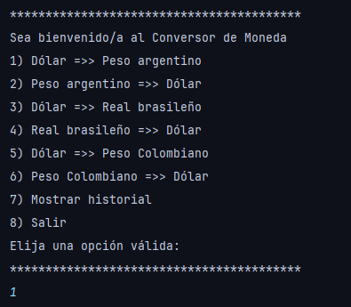
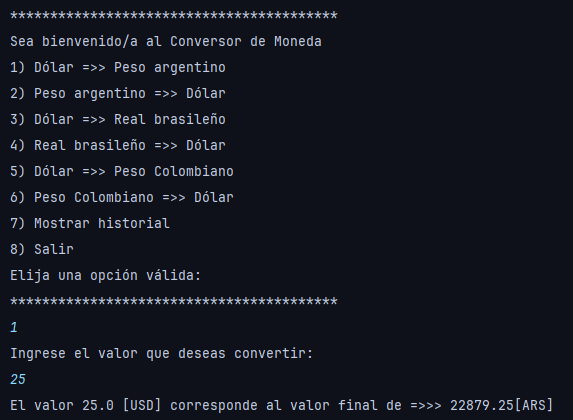
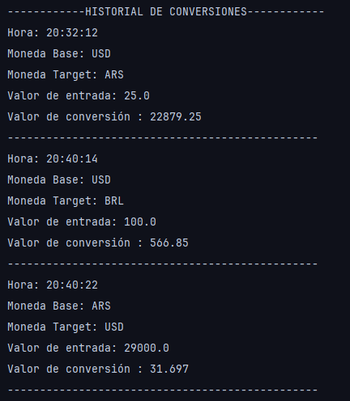

# **Conversor de Monedas Challenge Alura Back End**

## **Introducción**
Este proyecto consiste en una herramienta que facilita la conversión de monedas utilizando la API de _ExchangeRate_, la cual ofrece una amplia variedad de monedas para consultar y convertir.

## **Monedas disponibles**
Actualmente, se pueden realizar conversiones entre las siguientes monedas:

1. Dólar a Peso argentino
2. Peso argentino a Dólar
3. Dólar a Real brasileño
4. Real brasileño a Dólar
5. Dólar a Peso Colombiano
6. Peso Colombiano a Dólar

## **Funcionalidad**

La aplicación cuenta con un menú que permite seleccionar la operación deseada, incluyendo la opción para visualizar el historial de conversiones realizadas durante la ejecución.

En caso de ingresar un número inválido o texto, la aplicación mostrará un mensaje y se cerrará automáticamente.

## **Ejemplo**

**_Escribe el número correspondiente a la operación deseada y presiona enter:_**

**_Ingresa el valor a convertir y la conversión se realizará automáticamente:_**

**_Puedes repetir este procedimiento tantas veces como desees._**

Finalmente,
**_Para ver el historial, selecciona la opción 7 en el menú principal:_**

## Tecnologías usadas
Java 17
